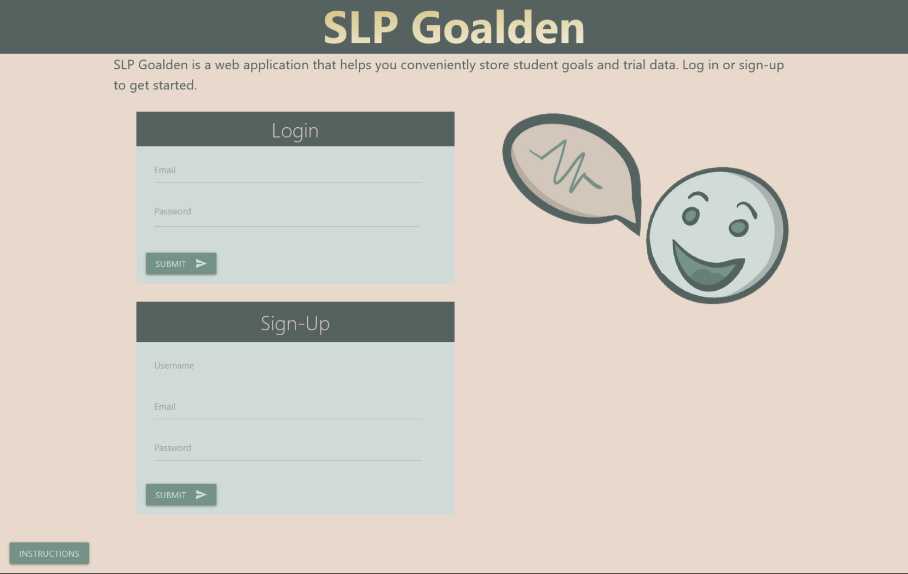

# Bootcamp Portfolio


## Group Project 2:

```
This student portfolio currently contains a new project called SLP Goalden. 
Please click link to view the project:
```

https://mighty-falls-97052.herokuapp.com/

````````
Please click SLP Goalden on the portfolio to view the group project.

``````
## Description 

SLP Goalden is a simple application designed to help speech language pathologists keep track of student goals and goal progress.

[](https://opensource.org/licenses/MIT)
